<div align="center">

# 📊 Ledgr

### Demand-Forecasting & SKU Management AI for FMCG Distributors

> *"From scan to shelf — turning every barcode into a smarter reorder."*

[](https://www.python.org/)
[](https://flask.palletsprojects.com/)
[](https://www.postgresql.org/)
[](https://lightgbm.readthedocs.io/)
[](https://docs.docker.com/compose/)
[](https://developer.android.com/kotlin)
[](LICENSE)

</div>

---

## 📌 Overview

**Ledgr** is an end-to-end demand-forecasting and inventory-orchestration platform for FMCG distributors. It pairs a **6-step LightGBM pipeline** with a **GST-compliant purchase-order workflow**, a **batch-aware reorder engine**, and a **RAG chatbot** that answers operational questions in natural language — all wrapped in a one-click Dockerized stack.

A salesman scans retail barcodes from an **Android scanner** in the field, the data syncs to **Postgres** over the same Wi-Fi, and the dashboard fuses it with **3 years of weekly sales history** to predict demand for the next 6 weeks per SKU per outlet.

The reorder engine then translates forecast confidence (**MAPE**) directly into safety-stock buffers — so when the model is sharp you carry less inventory, and when the model is shaky you carry more. The system pays for itself in working-capital savings.

> Originally built around 40 SKUs × 320 outlets across Pune & Nashik (~93K observed weekly sales rows expanded to a ~2M-row reconstructed grid). Architected to scale horizontally to thousands of SKUs and tens of thousands of outlets.

---

## 🖼️ Screenshots

<div align="center">

### 🔐 Login — Role-Based Access (Owner / Manager / Salesman)

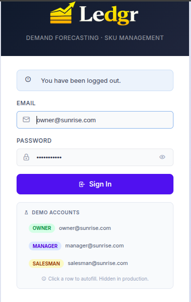

<br/><br/>

### 📊 Dashboard — Headline KPIs & AI Order Recommendations

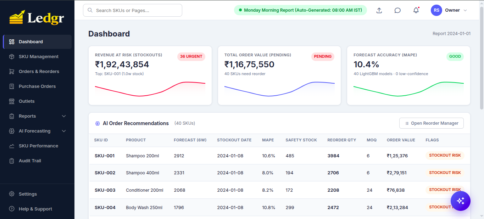

<br/><br/>

### 🤖 AI Chatbot — RAG-Grounded Operational Q&A

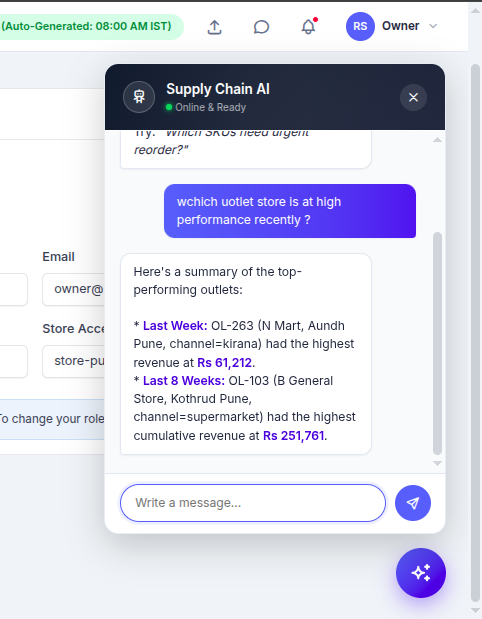

</div>

---

## ✨ Key Features

| 🚀 Capability | 📋 Description |
|---|---|
| 📈 **6-Step LightGBM Pipeline** | Data classification → forecast → retrospective → reorder → SKU classifier → executive report — runs Mondays 7:45 AM IST or on-demand |
| 🎯 **MAPE-Driven Safety Stock** | Per-SKU MAPE drives reorder buffer (0.5wk if MAPE <10%, 2wk if >20%) — accuracy directly determines inventory cost |
| 📱 **Android Barcode Scanner** | Kotlin + Jetpack Compose + ML Kit, pairs to server via QR code, offline queue with Room DB |
| 🧾 **GST-Compliant POs** | Auto-routes intrastate (CGST + SGST) vs interstate (IGST) using buyer/supplier state; downloadable PDF invoices with HSN codes |
| 📦 **Batch-Aware Inventory** | Tracks 103+ batches with expiry dates; flags critical (<14d), warning (14–30d), and excludes expiring stock from "available" before reorder |
| 🎟️ **Diwali 2023 Backtest** | 5-signal stockout detector with no lookahead bias — caught 10 of 14 known historical stockouts |
| 🤖 **RAG Chatbot** | TF-IDF retrieval over pipeline outputs + Gemini 2.0 Flash; deterministic local fallback if no API key |
| 🏪 **Multi-Channel Outlets** | 320 outlets across Kirana / Supermarket / Medical channels with per-channel performance rollups |
| 📨 **Monday Morning Report** | Auto-delivered to WhatsApp / Email / Telegram with executive summary, urgent orders, and overstock alerts |
| 🐳 **One-Click Stack** | `./run.sh` (Linux/macOS) or `.\run.ps1` (Windows) — auto-detects LAN IP, free port, Docker daemon |

---

## 💼 Why Owners Love Ledgr

The dashboard isn't just charts — every screen replaces something a person was doing manually before, every Monday, on a spreadsheet. The features below are the ones distributors actually quote when asked what changed after rollout.

### 🎯 Forecasts you can trust before you sign the cheque

- **Overall MAPE on a real 3-year history: 10.44%** — measured on a held-out 8-week window, one LightGBM model per SKU, never aggregated to category.
- Per-SKU **confidence band** (high / medium / low) shown next to every forecast, so the buyer can override the model on the few SKUs that earned that override.
- New / sparse SKUs (<10 non-zero weeks) auto-fall-back to a rolling-mean baseline rather than producing a confident-looking lie.

### 🚨 Stockouts caught _before_ they happen

- **Diwali 2023 retrospective: 10 of 14 known stockouts identified, 4 false positives — zero lookahead bias.** The 5-signal detector (capped surge / demand surge / Diwali 2022 pattern / inventory low / promo overlap) re-runs each year, so next festive season you know exactly which SKUs to overstock.
- Reorder engine uses **MAPE-driven dynamic safety stock** (0.5× to 2× weekly demand depending on per-SKU forecast accuracy) — high-confidence SKUs no longer carry a wasteful 2-week buffer; low-confidence ones get the cushion they actually need.
- Week-by-week stockout simulation uses **batch-aware available stock** (skips batches that expire before they could be sold) — so you don't reorder against ghost inventory and you don't write off cases of yoghurt at month-end.

### 💰 Money out the door, signed in two clicks

- **GST-compliant PO PDFs** auto-route CGST + SGST for intrastate suppliers and IGST for interstate ones based on the supplier's state vs your store's state — the kind of mistake that costs you a re-do at the auditor's desk.
- HSN codes pre-filled per category. Multi-line POs grouped by supplier so you sign one PDF per vendor, not 40.
- **Owner-only "Approve"** with a clear pending → approved → in-transit flow + an Audit Trail of who changed what and why.

### 🌅 Monday morning runs itself

- APScheduler fires at **07:45 IST every Monday**: logs last week's forecast vs actuals, retrains the LightGBM models, regenerates safety stock, builds the reorder list, ships it on **WhatsApp / Email / Telegram**.
- The Monday report bundles four sections owners actually read: `executive_summary` (one-line health), `urgent_orders` (today's must-place), `overstock_alerts` (capital trapped on shelves), `expiry_alerts` (batches you'd otherwise write off).
- Outlet **non-submission detector** flags which distributors missed two consecutive weeks _before_ you reorder against blind spots.

### 📲 Floor staff scan, not type

- Native **Android scanner** (CameraX + ML Kit, retail barcodes + QR). Pair-by-QR-code, sign in once, scan all day.
- **Offline-first**: every scan goes into a local Room queue and uploads when Wi-Fi returns. No "lost the count because the office router rebooted."
- One scan = one confirm card. Quantity in, save, done. Replaces the tally-sheet-into-Excel step entirely.

### 💬 Ask anything, in plain English

- Sparkles button (lower right) opens an LLM chatbot wired to **69 retrieval chunks** spanning every dashboard domain: SKU master, outlets, suppliers, batches, POs, pipeline runs, data quality, forecasts, retrospective accuracy, classification.
- Real questions answered without waking an analyst:
  - _"Which outlet sold the most last week?"_ → OL-263 N Mart Aundh Pune, ₹61,212
  - _"Show supplier performance and lead times."_ → 12 vendors, avg 9.0d, P80 12.0d, festive 15.6d
  - _"Any batches near expiry?"_ → 29 critical (<14 days), with SKU IDs and exact days remaining
- TF-IDF retrieval keeps cost bounded as the catalogue grows — token spend doesn't balloon when you add SKU 41 or outlet 321.

### 🔐 Multi-store, role-aware, audit-ready

- One owner login sees both Pune and Nashik. **Manager logins are auto-scoped** to their store — they can't approve a PO they shouldn't see in the first place.
- **Audit Trail** logs every inventory adjustment with user, reason, and timestamp. Compliance-ready for GST audits and internal controls.
- **Data Quality firewall** (`ingestion.py`) rejects negative units, unknown SKU/outlet pairs, duplicates, and >15% week-over-week row-count drops — so a corrupted upload doesn't silently poison next week's forecast.

### ⚡ One command, five minutes, on any laptop

- `./run.sh` (or `.\run.ps1` on Windows) auto-creates `.env`, detects your LAN IP for Android pairing, finds a free port if 5000 is taken, and waits until the dashboard is genuinely up before printing the URL.
- First boot ~60 seconds, including the seed and the very first pipeline run. Subsequent boots in ~5 seconds.
- Reset to a clean demo with `docker compose down -v` — useful before showing a customer.

---

## 🚀 Quick Start

### 1️⃣ Prerequisites

| | Why | Install |
|---|---|---|
| **Docker Desktop** ≥ 20.10 | runs the web + Postgres + scheduler stack | https://docs.docker.com/get-docker/ |
| **Git** | clone the repo | https://git-scm.com/downloads |
| *(optional)* **Android Studio** | only if rebuilding the scanner APK | https://developer.android.com/studio |

A laptop with 4 GB free RAM is enough. The full image is ~600 MB.

### 2️⃣ Clone & Launch

```bash
git clone https://github.com/HoneyBadger-010/Ledgr-Retail-SKU-Management-Tool.git
cd Ledgr-Retail-SKU-Management-Tool
```

**Linux / macOS:**

```bash
./run.sh
```

**Windows (PowerShell):**

```powershell
.\run.ps1
```

The launcher does it all — pre-flight checks, `.env` auto-create, LAN IP detection, port auto-route (5000 → 5001/5050/8000/8080/8888), background boot, and waits for `/login` to actually answer before printing success.

### 3️⃣ Open & Sign In

Open **http://localhost:5000** and use a demo account:

| Role | Email | Password | What you see |
|---|---|---|---|
| 👑 **Owner** | `owner@sunrise.com` | `sunrise2024` | Everything — incl. PO approval, SKU delete, pipeline trigger |
| 👨‍💼 **Manager** | `manager@sunrise.com` | `manager2024` | Everything except approve/delete |
| 👷 **Salesman** | `salesman@sunrise.com` | `sales2024` | Redirects to mobile barcode-scan PWA |

> **First boot only:** ~3–5 minutes (image build + Postgres init + 6-step pipeline). Subsequent boots: ~5 seconds. See [SETUP.md](SETUP.md) for full handoff and troubleshooting.

### 4️⃣ (Optional) Enable the AI Chatbot

The chatbot has a **local keyword fallback** that works offline. For full LLM responses (Gemini 2.0 Flash via OpenRouter):

```bash
cp .env.example .env
# Edit .env and set OPENROUTER_KEY=sk-or-v1-...   (free tier at https://openrouter.ai/keys)
docker compose restart web
```

---

## 🏗️ System Architecture

```
                                   ┌────────────────────────┐
                                   │  Android Scanner App   │
                                   │  Kotlin + ML Kit       │
                                   │  (offline Room queue)  │
                                   └───────────┬────────────┘
                                               │ HTTP over LAN (QR-paired)
                                               ▼
        ┌──────────────────┐        ┌────────────────────────┐        ┌──────────────────┐
        │  Web Browser     │ ─────► │  Flask + Gunicorn      │ ◄───── │  Mobile PWA      │
        │  (Tabler UI)     │        │  /api/*  /auth         │        │  /mobile/        │
        └──────────────────┘        └───────────┬────────────┘        └──────────────────┘
                                                │
                ┌───────────────────────────────┼───────────────────────────────┐
                ▼                               ▼                               ▼
        ┌──────────────┐              ┌──────────────────┐             ┌──────────────────┐
        │  PostgreSQL  │              │   APScheduler    │             │   RAG Chatbot    │
        │  (15-alpine) │              │   weekly cron    │             │   TF-IDF + LLM   │
        │  + batches   │              │   Mon 7:45 IST   │             │   (Gemini Flash) │
        │  + POs       │              └────────┬─────────┘             └──────────────────┘
        └──────────────┘                       │
                                               ▼
                       ┌────────────────────────────────────────┐
                       │       6-Step LightGBM Pipeline         │
                       │  clean → forecast → retro →            │
                       │  reorder → classify → report           │
                       └────────────────────────────────────────┘
                                               │
                                               ▼
                       ┌────────────────────────────────────────┐
                       │  Monday Report → WhatsApp / Email /    │
                       │                  Telegram              │
                       └────────────────────────────────────────┘
```

---

## 🧠 The 6-Step Pipeline

| Step | Script | What it does | Output |
|:---:|---|---|---|
| 1️⃣ | `1_clean_data.py` | Reconstructs full week × SKU × outlet grid; classifies missing rows as `true_zero` / `non_reporting` / `stockout_gap` / `uncertain` | `sales_classified.csv`, `classification_report.json` |
| 2️⃣ | `2_forecast.py` | LightGBM per-SKU, 6-week horizon; computes test-set MAPE | `forecasts.csv`, `forecast_accuracy.json` |
| 3️⃣ | `3_retrospective.py` | Diwali 2023 stockout backtest (5 signals, no lookahead) | `top_14_stockout_skus.json` |
| 4️⃣ | `4_reorder_engine.py` | Batch-aware available stock × MAPE-driven safety stock × week-by-week chronological simulation | `reorder_recommendations.csv` |
| 5️⃣ | `5_sku_classifier.py` | Movement (fast / slow / seasonal / dead) + ABC tier | `sku_classification.csv` |
| 6️⃣ | `6_report_generator.py` | Executive summary, urgent orders, overstock + expiry alerts | `monday_report.json` |

<div align="center">

### 📈 AI Forecasting Page — Live MAPE Dashboard

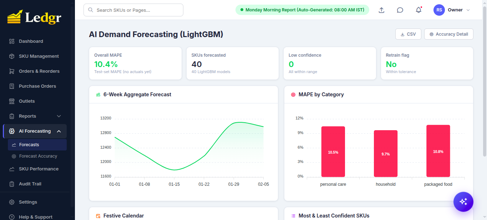

<br/><br/>

### 🎯 Forecast Accuracy Deep-Dive — MAPE Distribution + Model Split

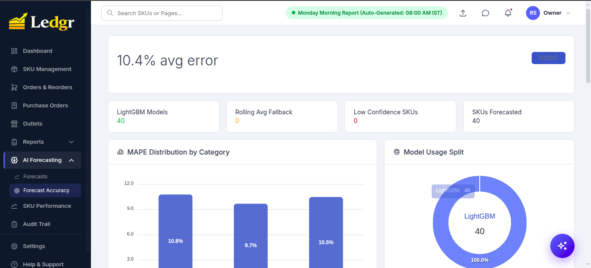

</div>

---

## 📐 MAPE — The Heart of Ledgr

**MAPE (Mean Absolute Percentage Error)** is *the* metric that makes the system economically intelligent. It directly translates forecast confidence into rupees of working capital.

### Formula

```python
mape = abs(actual - forecast) / max(actual, 1) * 100
```

For each SKU, the system stores the weekly contribution and reports the **rolling 4-week average** as that SKU's headline MAPE. The overall system MAPE is the average across all SKUs.

### How MAPE Becomes Inventory

| Per-SKU MAPE | Safety Stock Buffer | Interpretation |
|:---:|:---:|---|
| **< 10%** | 0.5 weeks | Forecast is sharp — minimal cushion |
| **10 – 20%** | 1.0 week | Standard buffer |
| **> 20%** | 2.0 weeks | Forecast is shaky — double buffer |
| *no data yet* | 1.5 weeks | Default cautious |

> Multiplied by **1.5×** during festive periods (Diwali, etc.) — festive demand is intrinsically harder to predict.

### Worked Example

SKU-007 sells **100 units/week**. Lead time 1 week, current stock 80, 6-week forecast = 600 units.

| | MAPE = 8% (sharp) | MAPE = 25% (shaky) |
|---|---|---|
| Safety stock | 100 × 0.5 = **50** units | 100 × 2.0 = **200** units |
| Reorder qty | 600 + 50 + 100 − 80 = **670** | 600 + 200 + 100 − 80 = **820** |

**Same SKU, same demand — but you order 150 units more (~22%) purely because the model is less confident.**

> 💡 **The mental model:** *MAPE is the price of trust. As the model improves, working capital is freed automatically. The buyer isn't paying for forecasting — they're paying for an inventory policy that self-tightens as the model gets smarter.*

For a deeper walk-through see [PROJECT_REFERENCE.md §3–§4](PROJECT_REFERENCE.md).

---

## 📦 SKU Management — The Master Catalog

40 demo SKUs ship pre-loaded with full master data: HSN, GST rate, supplier, lead time, MOQ, shelf life, brand, category, ABC class, and movement profile.

<div align="center">

### 📋 All SKUs — Sortable, Filterable, CSV Exportable

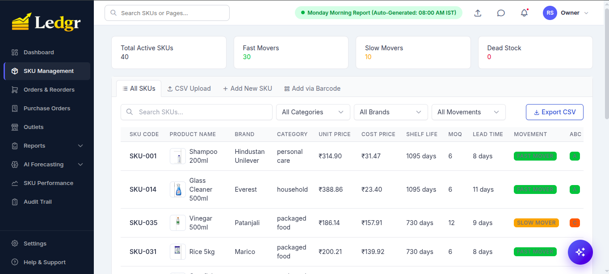

<br/><br/>

### 📥 Bulk Import — CSV Upload

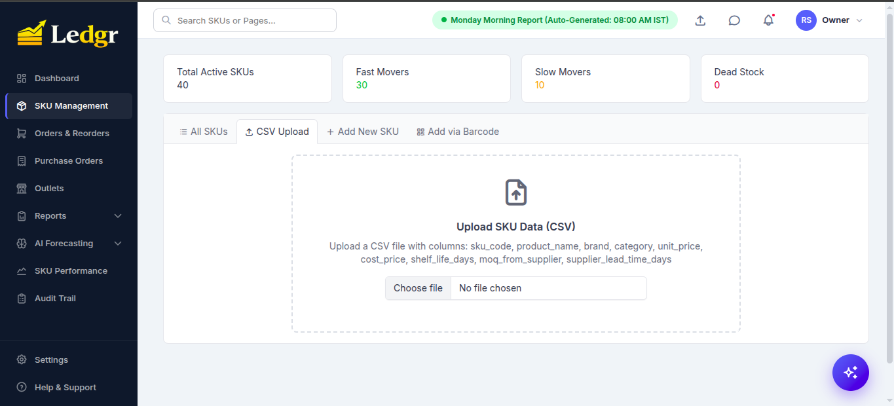

Onboarding hundreds or thousands of SKUs at once? Drop a single CSV with the required columns (`sku_code`, `product_name`, `brand`, `category`, `unit_price`, `cost_price`, `shelf_life_days`, `moq_from_supplier`, `supplier_lead_time_days`) and the entire master is ingested in one shot. Optional fields like HSN code, GST rate, and supplier GSTIN can be added in the same file or filled in later via the Add-New form.

<br/>

### ➕ Add New SKU — Full GST + Supplier Capture

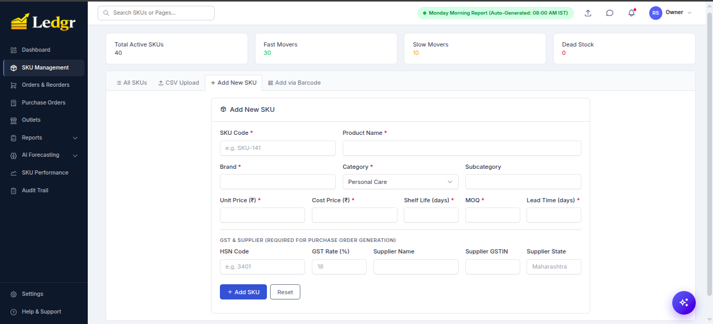

<br/><br/>

### 📷 Add via Barcode — QR-Pair the Android Scanner

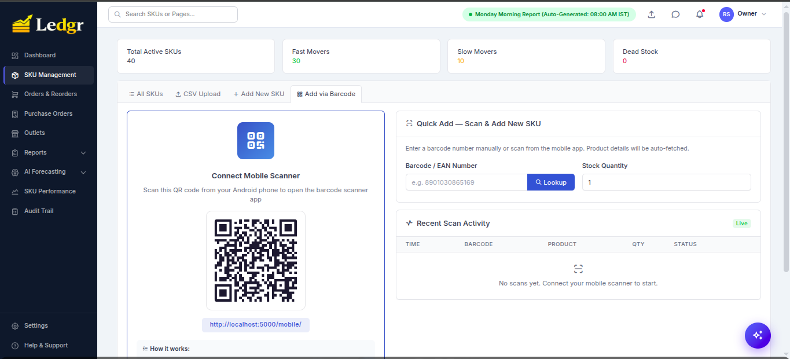

</div>

The salesman opens the Android app, scans the QR shown on the dashboard, and the phone is paired to the server. Subsequent retail-barcode scans (EAN / UPC / Code-128) sync to the dashboard's **Recent Scan Activity** stream live.

---

## 🛒 Reorder & GST-Compliant Purchase Orders

The reorder engine generates per-SKU recommendations that the owner can edit, multi-select, and approve in one click. Approved orders get grouped by supplier and emitted as **GST-compliant POs** — automatically routing intrastate (CGST + SGST) vs interstate (IGST) based on the buyer/supplier state pair.

<div align="center">

### 🛒 Orders & Reorders Manager — Pending Approval Queue

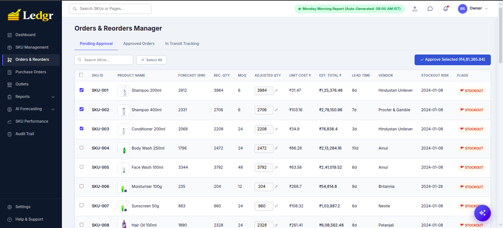

<br/><br/>

### 🧾 Purchase Orders — Auto-Grouped by Supplier with GST Routing

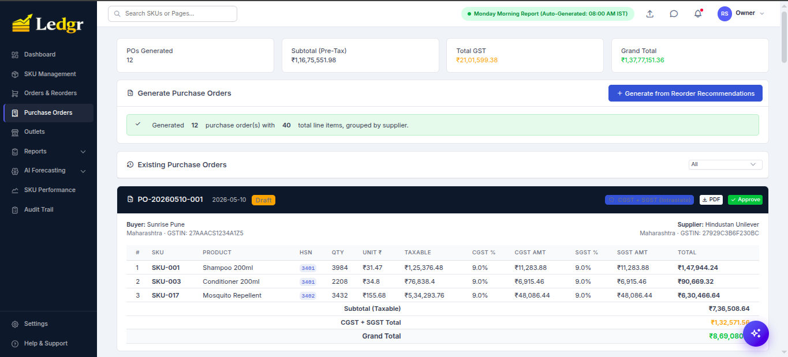

<br/><br/>

### 📄 PDF Invoice — Tax Invoice Format with HSN + GSTIN

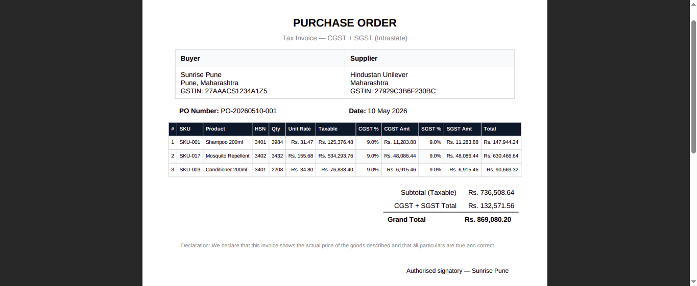

</div>

Every PO has:
- **Auto-generated PO number** (`PO-YYYYMMDD-NNN`)
- **HSN codes** per line item (read from the SKU master, no hardcoded 18%)
- **Correct GST routing** — CGST+SGST when buyer.state == supplier.state, IGST otherwise
- **PDF download** in tax-invoice format with declaration + authorised-signatory line
- **Audit-ready** record persisted in the `purchase_orders` table

---

## 🏪 Outlet Network & Supplier Analytics

<div align="center">

### 🏪 Outlet Network — 320 Outlets Across 3 Channels

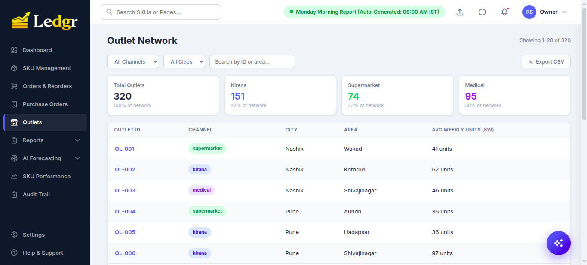

<br/><br/>

### 🚚 Supplier Performance — Lead Time & Festive Variance

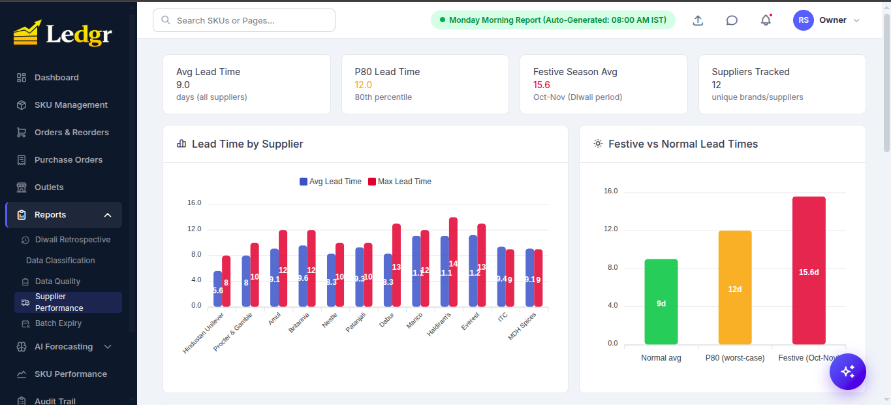

</div>

Channel-aware sales rollups, per-supplier lead-time variance, P80 worst-case days, and a **festive multiplier (~1.3×)** baked into Oct–Nov estimates so reorder timing accounts for Diwali-induced delays.

---

## 📊 SKU Performance Drill-Down

<div align="center">

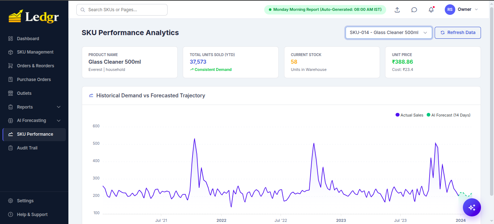

</div>

For any SKU you can see:
- **Historical demand vs forecast** — multi-year trajectory with the AI's 14-day forward forecast overlaid
- **Movement label** — Consistent / Seasonal / Volatile / Declining
- **Stock-cover indicator** — current weeks of cover
- **Cost vs price** — gross margin per unit

---

## 🤖 AI Chatbot — RAG Over Pipeline Outputs

The sparkles button at the bottom-right opens a chatbot grounded in the **actual operational data** of the system (not the LLM's memory).

<div align="center">


</div>

**How it works:**

1. Every pipeline run rebuilds **~100 chunks** from `monday_report.json`, `forecast_accuracy.json`, `reorder_recommendations.csv`, outlet/supplier/batch/PO/pipeline DB tables, etc.
2. **TF-IDF + cosine similarity** (sklearn — no 500 MB embedding model needed) ranks chunks against the user query.
3. **Top-10 chunks** + the executive summary are fed to **Gemini 2.0 Flash** (via OpenRouter) with a strict system prompt forbidding hallucination.
4. **No API key?** A deterministic keyword router still answers the dozen most-common questions from the same data files.

Try asking:
- *"Which SKUs need urgent reorder?"*
- *"What's the best-performing outlet last week?"*
- *"Tell me about SKU-007"*
- *"How is our forecast accuracy?"*
- *"Show me the Diwali analysis"*
- *"Any overstock risk?"*

---

## ⚙️ Settings & Multi-Store Access

<div align="center">

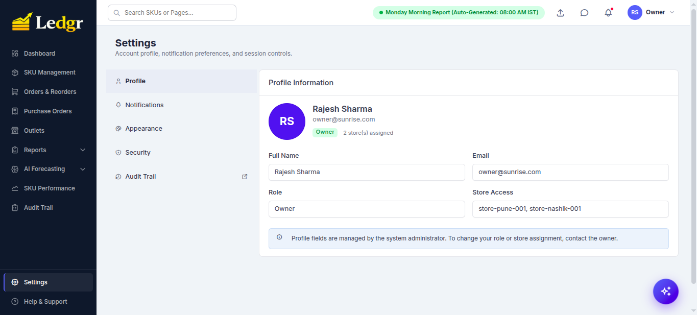

</div>

Each user is scoped to one or more **stores** (e.g. `store-pune-001`, `store-nashik-001`). All KPIs, reorder recs, and POs filter by the user's assigned stores. A salesman sees only their own outlet; a manager sees their region; an owner sees the whole network.

---

## 🛠️ Tech Stack

| Layer | Technologies |
|---|---|
| **Frontend** | Tabler UI · ApexCharts · Vanilla JS |
| **Backend** | Python 3.12 · Flask 3.0 · Flask-Login · Flask-Mail · Gunicorn (2 workers) |
| **Database** | PostgreSQL 15 · SQLAlchemy 2.0 · psycopg2 |
| **ML / Forecasting** | LightGBM 4.6 · scikit-learn (TF-IDF for RAG) · pandas · numpy |
| **Scheduling** | APScheduler 3.11 (Mon 7:45 AM IST cron) |
| **AI Chatbot** | Google Gemini 2.0 Flash via OpenRouter · TF-IDF retrieval |
| **Android** | Kotlin · Jetpack Compose · CameraX + ML Kit · Room (offline queue) |
| **DevOps** | Docker · Docker Compose · Bash + PowerShell launchers |
| **Notifications** | Twilio (WhatsApp) · Flask-Mail (SMTP) · Telegram Bot API |

---

## 📂 Project Structure

```
Ledgr-Retail-SKU-Management-Tool/
├── app.py                          # Flask routes, /api/chat, role guards
├── auth.py                         # Demo accounts, role-required decorator
├── database.py                     # SQLAlchemy models init, MAPE rollups, seeding
├── models.py                       # SKU, Outlet, Batch, PO, ForecastAccuracyLog
├── rag.py                          # TF-IDF chunk builder + retriever
├── notifications.py                # WhatsApp / Email / Telegram fan-out
├── scheduler.py                    # APScheduler weekly cron worker
├── backend/
│   ├── 1_clean_data.py             # Step 1: data classification
│   ├── 2_forecast.py               # Step 2: LightGBM 6-week forecast
│   ├── 3_retrospective.py          # Step 3: Diwali 2023 backtest
│   ├── 4_reorder_engine.py         # Step 4: MAPE-driven reorder
│   ├── 5_sku_classifier.py         # Step 5: movement + ABC
│   └── 6_report_generator.py       # Step 6: monday_report.json
├── templates/                      # Jinja2 + Tabler dashboards
│   ├── overview.html               # Dashboard with KPI tiles
│   ├── forecast.html               # AI Forecasting page
│   ├── accuracy.html               # MAPE deep-dive
│   ├── reorder.html                # Approval queue
│   ├── purchase_orders.html        # GST POs
│   ├── outlets.html                # Outlet network
│   ├── sku_management.html         # SKU master CRUD
│   └── base.html                   # Sidebar + chatbot widget
├── android/                        # Kotlin scanner app
│   └── app/build/outputs/apk/debug/app-debug.apk
├── data/
│   ├── sku_master.csv              # 40 SKUs
│   ├── outlet_master.csv           # 320 outlets
│   ├── sales_history.csv           # 3 years × ~93K rows
│   └── processed/                  # Pipeline outputs (gitignored)
├── scripts/
│   └── log_weekly_actuals.py       # Cron job — writes forecast_accuracy_log
├── Screenshot/                     # README assets
├── docker-compose.yml              # web + db + scheduler
├── Dockerfile                      # Python 3.12-slim, gunicorn -w 2
├── run.sh / run.ps1                # One-shot launchers
├── SETUP.md                        # 10-section handoff guide
├── PROJECT_REFERENCE.md            # MAPE deep-dive + enterprise audit
└── README.md
```

---

## 🌐 API Reference (selected)

| Method | Endpoint | Purpose |
|---|---|---|
| `POST` | `/auth/login` | Authenticate user, set session cookie |
| `GET`  | `/api/dashboard-summary` | Exec summary, pipeline status, alerts in one shot |
| `GET`  | `/api/sku-list` | All SKUs scoped to user's stores |
| `GET`  | `/api/forecasts` | 6-week forecast per SKU |
| `GET`  | `/api/forecast-accuracy` | Rolling 4-week MAPE per SKU + overall |
| `GET`  | `/api/reorder-recommendations` | Engine output with reasoning |
| `POST` | `/api/orders/approve` | Approve selected reorder rows → POs |
| `GET`  | `/api/orders/list` | Approved + draft POs |
| `POST` | `/api/generate-po` | Group approved orders by supplier, emit GST-routed POs |
| `GET`  | `/api/po/<po_number>/pdf` | Tax-invoice PDF |
| `GET`  | `/api/outlet-performance` | Top/bottom outlets, channel rollups |
| `GET`  | `/api/supplier-performance` | Lead time, P80, festive estimates |
| `GET`  | `/api/batch-expiry` | Critical / warning / healthy batches |
| `POST` | `/api/run-pipeline` | Re-run the 6-step pipeline (owner only) |
| `POST` | `/api/chat` | RAG-grounded chatbot reply |
| `POST` | `/api/scan` | Android scanner ingestion |

---

## 📊 What You Get Out of the Box

After step 3 of Quick Start, the dashboard is already populated with:

- **40 SKUs** with full master data (HSN, GST, supplier, lead time, MOQ, shelf life)
- **320 outlets** across Pune & Nashik (Kirana, Supermarket, Medical)
- **3 years of weekly sales history** (~93 K observed rows, ~2 M-row reconstructed grid)
- **103 inventory batches** (29 critical / <14 days to expiry)
- **6-week LightGBM forecast** + 10.4% overall MAPE
- **Diwali 2023 retrospective** (10/14 known stockouts identified)
- **12 pre-generated POs** in draft status, totaling ₹1.37 Cr
- **Monday morning report** ready to read or trigger

You can start clicking immediately. No data import needed.

---

## 🗺️ Roadmap

### Pre-Production Hardening
- [ ] **Fix DB connection pooling** — `pool_pre_ping` + `post_fork` engine dispose to eliminate `psycopg2 lost synchronization` errors under gunicorn workers
- [ ] **Replace hardcoded `store_id='store-pune-001'`** in PO creation with the user's primary store
- [ ] **Bump Dockerfile healthcheck `start_period`** to 400s so first-boot doesn't false-fail
- [ ] **Migrate demo accounts** from hardcoded `auth.py` dict to the `users` table; add forced password rotation
- [ ] **Add Alembic migrations** to replace ad-hoc `ALTER TABLE` calls
- [ ] **Add audit log** for PO approve / SKU delete / inventory adjust
- [ ] **Add rate limiting** (Flask-Limiter) on `/auth/login`, `/api/run-pipeline`, `/api/chat`

### Product Roadmap
- [ ] **Sales-weighted MAPE (wMAPE)** as an option alongside unweighted average
- [ ] **Multi-tenant onboarding API** — separate chains, isolated SKU + outlet masters
- [ ] **Hourly forecast cadence** for high-velocity SKUs (current cadence: weekly)
- [ ] **Embedding-based retrieval** in RAG — replace TF-IDF with `text-embedding-3-small` for semantic recall
- [ ] **iOS scanner app** (Swift + VisionKit barcode)
- [ ] **Predictive shelf-life optimization** — recommend price-down promos for batches approaching expiry
- [ ] **HTTPS enforcement** + nginx reverse proxy template + cleartext-disabled APK build

See [PROJECT_REFERENCE.md §6](PROJECT_REFERENCE.md) for the full enterprise-readiness audit with severity tags.

---

## 🚧 Going to Production

The defaults are tuned for local demo. Before deploying for real users:

1. Replace `FLASK_SECRET_KEY` in `.env` with `python -c "import secrets; print(secrets.token_urlsafe(48))"`
2. Set `FLASK_ENV=production` (the app refuses to start under prod with the dev secret)
3. Set `HIDE_DEMO_CREDENTIALS=1` to remove the demo-account block on the login page
4. Migrate `DEMO_USERS` out of `auth.py` into the real `users` table
5. Set `OPENROUTER_KEY` for live LLM chat
6. Set `LEDGR_PUBLIC_HOST` to the externally-routable hostname
7. Front Gunicorn with nginx + a real TLS cert; flip `usesCleartextTraffic=false` in the Android manifest and rebuild
8. Configure WhatsApp (Twilio) / Email (Flask-Mail) / Telegram for Monday-morning notifications

Full handoff details in [SETUP.md §8](SETUP.md).

---

## 🧪 Common Operations

| Goal | Command |
|---|---|
| Start in foreground (see logs) | `./run.sh` |
| Start in background | `./run.sh -d` |
| Stop | `docker compose down` |
| **Reset everything** (drops Postgres + pipeline outputs) | `docker compose down -v` |
| Stream web logs | `docker compose logs -f web` |
| Stream scheduler logs | `docker compose logs -f scheduler` |
| Re-run the pipeline | Owner → SKU Management → top-right "Run Pipeline" button |
| Open a Postgres shell | `docker compose exec db psql -U ledgr -d ledgr` |
| Update to a newer commit | `git pull && docker compose up -d --build` |

---

## ⚠️ Disclaimer

> This system was built initially as a hackathon project and is being commercialized. The shipped demo accounts and seed data are for **evaluation only**. Before deploying for real-world commercial use, complete the **Pre-Production Hardening** checklist above. See [PROJECT_REFERENCE.md §6](PROJECT_REFERENCE.md) for the full enterprise-readiness audit.

---

## 🤝 Contributing

1. Fork the repository
2. Create a feature branch (`git checkout -b feature/amazing-feature`)
3. Commit your changes (`git commit -m 'Add amazing feature'`)
4. Push to the branch (`git push origin feature/amazing-feature`)
5. Open a Pull Request

Issues and feature requests welcome at https://github.com/HoneyBadger-010/Ledgr-Retail-SKU-Management-Tool/issues.

---

## 📄 License

Released under the **MIT License** — see `LICENSE` for details.

---

## ⭐ Acknowledgements

- **Microsoft Research** for LightGBM
- **Tabler** for the dashboard UI kit
- **Google ML Kit** for the on-device barcode recognizer
- **OpenRouter** for unified LLM API access
- **scikit-learn** for the lightweight TF-IDF retrieval that replaced a 500 MB embedding stack

---

<div align="center">

⭐ *If you find this project useful, please consider giving it a star!*

📧 *For enterprise inquiries: open an issue or reach out via GitHub.*

</div>
